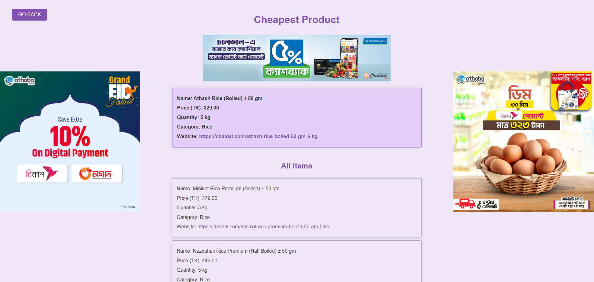
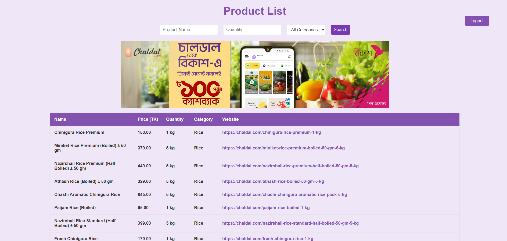
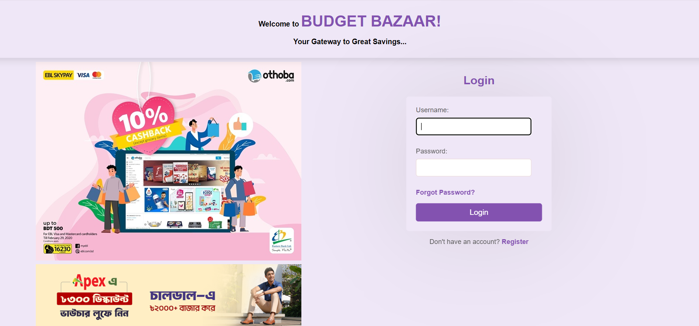

# Budget Bazaar: Automated Grocery Price Comparison Engine

**A full-stack Django data engineering platform that aggregates and compares real-time grocery prices from major e-commerce vendors (Chaldal, Othoba, SobjiBazaar) using a hybrid scraping pipeline.**


[](Project_Report.pdf)

---

## 👥 Authors

- **Ahsan Rizvi**
- **Mohammad Irtiza Hossain Mahmud**

*Department of Electrical and Computer Engineering, North South University*

---

## 🚀 Executive Summary

"Budget Bazaar" was developed to address market opacity in the Bangladeshi grocery sector. With rising inflation, consumers struggle to find the best deals across fragmented e-commerce platforms.

This system serves as a **centralized intelligence engine** that:
1.  **Harvests Data:** Automatically scrapes thousands of SKUs daily from competing vendors.
2.  **Normalizes Units:** Converts inconsistent units (e.g., "1kg", "1000gm", "1 pc") into a standard format for fair comparison.
3.  **Predicts Savings:** Dynamically identifies the lowest price for a user's specific query.

---

## 📸 System Interface

### 1. Smart Search & Comparison
*The engine instantly ranks products by price across vendors when a user searches (e.g., "Rice").*


### 2. Live Product Catalog
*A unified view of inventory scraped from multiple sources, updated every 24 hours.*


### 3. Secure User Hub
*Authentication system allowing users to track preferences and potential savings.*


---

## 🛠️ Technical Architecture

### 1. The Hybrid Scraping Engine (`scripts/scrape_and_save.py`)
To handle different web architectures, we implemented a dual-strategy pipeline:

| Target Vendor | Technology Used | Challenge Solved |
| :--- | :--- | :--- |
| **Chaldal.com** | `BeautifulSoup` + `Requests` | High-speed parsing of static HTML structures. |
| **Othoba.com** | **Selenium WebDriver** | Bypassing JavaScript-rendered pricing and dynamic DOM elements. |
| **SobjiBazaar** | `BeautifulSoup` | Efficient extraction of server-side rendered catalogs. |

### 2. Data Cleaning & Normalization
Raw data is often "dirty." We utilize **Regular Expressions (Regex)** to standardize pricing and quantity:
```python
# Code Snippet: Cleaning messy price strings
raw_price = "৳ 250.00 / kg"
clean_price = re.sub(r'[^\d.]', '', raw_price) # Result: 250.00

```

### 3. Automation Layer (`scripts/scraping_scheduler.py`)

A background daemon runs on a 24-hour cron job to ensure price accuracy without manual intervention.

```python
schedule.every().day.at("00:00").do(scrape_and_save_data)

```

---

## 📂 Database Schema

The system uses a relational SQLite/PostgreSQL architecture designed for scalability.

* **Products Table:** Stores normalized Name, Price, Unit, and Vendor URL.
* **Categories Table:** Linked via ForeignKey to support hierarchical filtering (e.g., Meat, Fish, Spices).
* **Users Table:** Standard Django Auth user management.

---

## ⚙️ Installation & Setup

### Prerequisites

* Python 3.8+
* Google Chrome & ChromeDriver (for Selenium)

### 1. Clone the Repository

```bash
git clone [https://github.com/ahsanrizvi99/budget-bazaar-engine.git](https://github.com/ahsanrizvi99/budget-bazaar-engine.git)
cd budget-bazaar-engine

```

### 2. Install Dependencies

```bash
pip install -r requirements.txt

```

### 3. Initialize Database

```bash
python manage.py migrate

```

### 4. Run the Application

The repo includes a pre-populated database (`db.sqlite3`) for immediate testing.

```bash
python manage.py runserver

```

Access the portal at: `http://127.0.0.1:8000/`

---

## 📂 Repository Structure

```text
/Budget-Bazaar-Engine
│
├── /grocery_comparison       # Core Project Settings
├── /products                 # Application Logic (Views, Models)
├── /scripts                  # Data Engineering Logic
│   ├── scrape_and_save.py    # The Scraping Engine
│   └── scraping_scheduler.py # The Automation Daemon
│
├── /templates                # Frontend Templates
├── /static                   # Static Assets (CSS, JS)
├── /screenshots
├── /Project_Report.pdf                   
├── db.sqlite3                # Database File
└── manage.py                 # Django Command Utility

```

---

## 📜 License & Attribution

This project is released under the **Creative Commons Attribution-NonCommercial 4.0 International (CC BY-NC 4.0)** license.

**You are free to:**

* **Share** — copy and redistribute the material in any medium or format.
* **Adapt** — remix, transform, and build upon the material.

**Under the following terms:**

* **Attribution (Credit Required):** You must give appropriate credit to the original author (**Ahsan Rizvi**), provide a link to this repository, and indicate if changes were made.
* **NonCommercial:** You may not use the material for commercial purposes without explicit permission.

> *If you use this code in your own research or project, please cite:*
> **Rizvi, A. (2024). Budget Bazaar: Automated Grocery Price Comparison Engine. GitHub Repository.**

